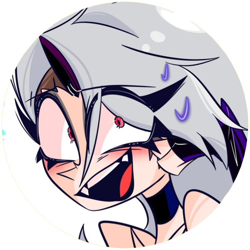

# Crydiaa

## Mon premier bot discord
### Crydiaa est un bot admin/utilisateurs avec des commandes diversifiés :

| Commandes  | Effects |
| ------------- | ------------- |
| -help [url]  | Affiche la liste des commandes  |
| -play  | Permet de jouer une musique  |
| -skip  | Permet de passer une musique  |
| -stop  | Arréte la musique  |
| -roll  | Fait un tirage au sort  |
| -kick [user]  | Expulse un membre du serveur (admin)  |
| -ban [user]  | Bannie un membre du serveur (admin)  |
| -purge [nombre]  | Supprime les message du salon (admin)  |
| -nsfw  | Affiche la liste des commandes NSFW  |
| -giveaway [temps ; prix] | Crée un tirage au sort chronométrer  |
| -me  | Affiche les informations utilisateur  |

# SongBot

## Tuto pour crée un bot musical avec discord.js
